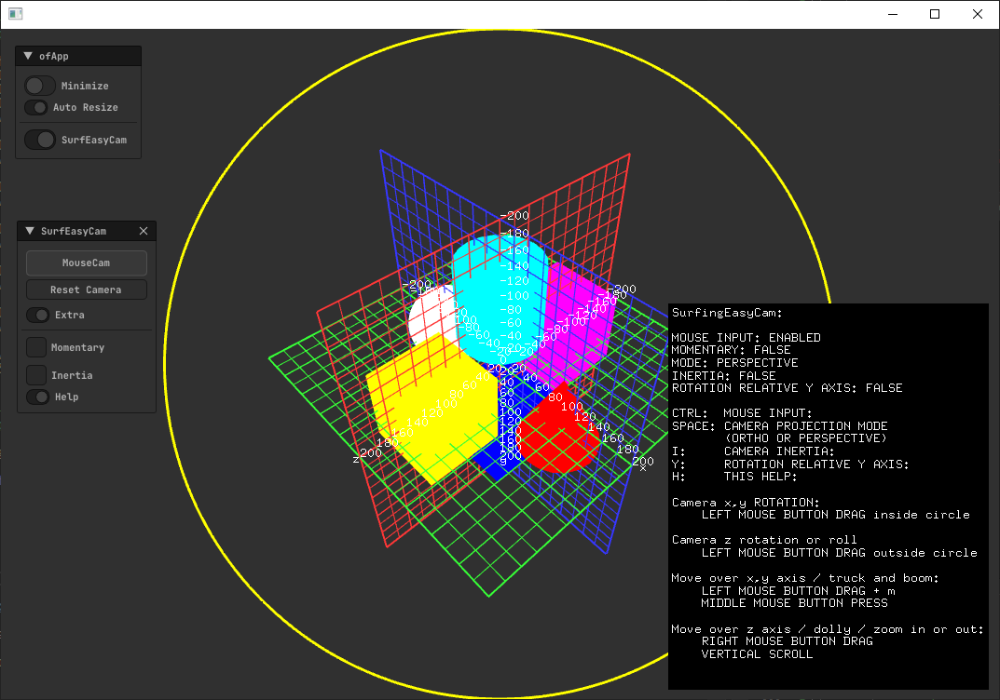
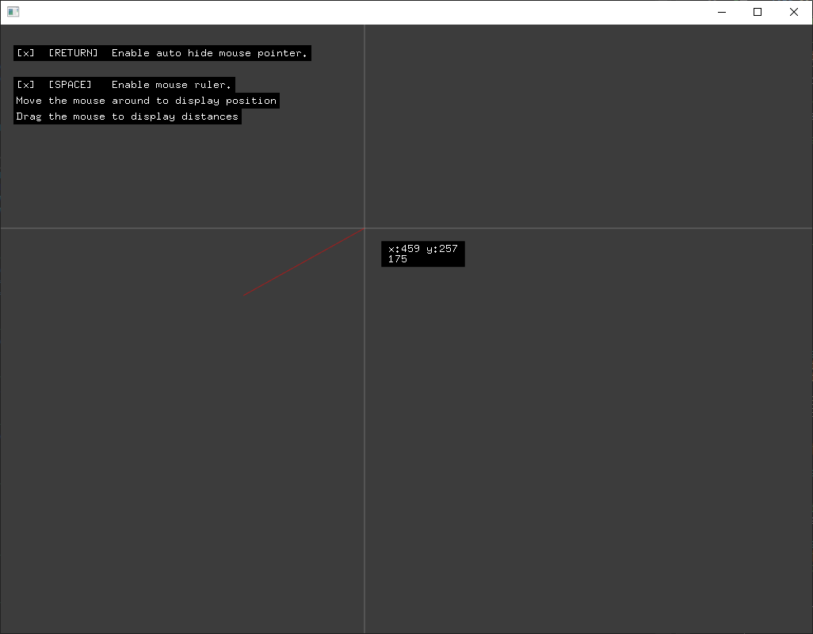
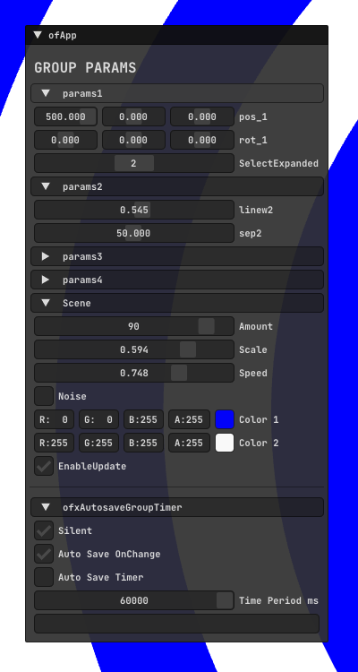
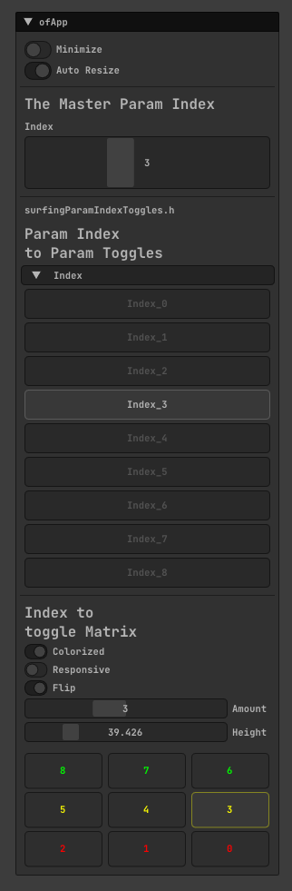
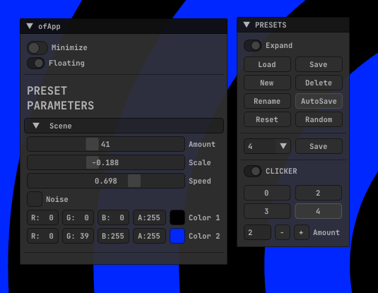
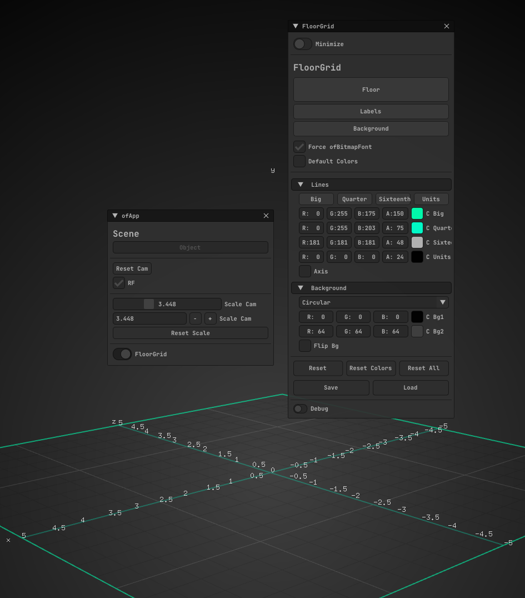
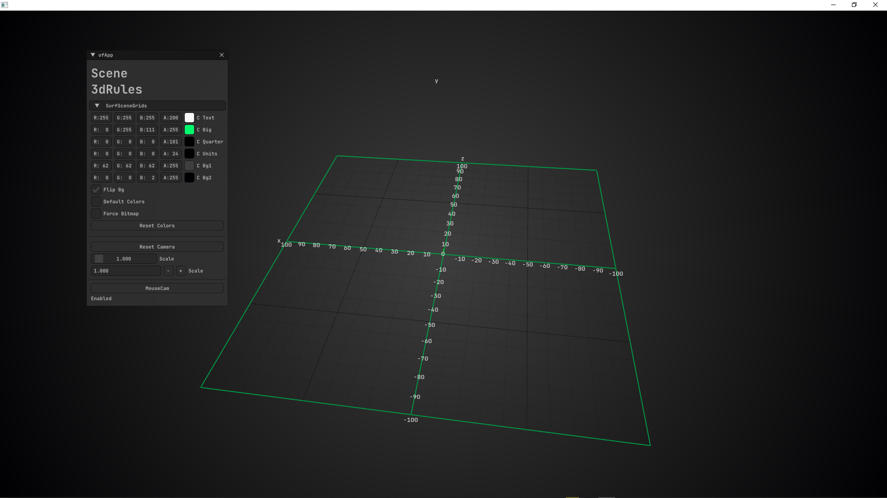

# surfingEasyCam.h / Camera workflow.
  

# surfingMouseHandler.h / Mouse rules.
  

# ofxAutosaveGroupTimer.h / Auto handle parameters settings.
  

# surfingParamIndexToggles.h / UI helper.
  

# ofxSurfingPresetsLite.h, surfingSceneTesters.h / Presets system and scene for testing.
  

# surfingScene3dRules.h / Floor grid.
  

# surfingScene3dRules.h, surfingMaths.h / Floor grid.
  
